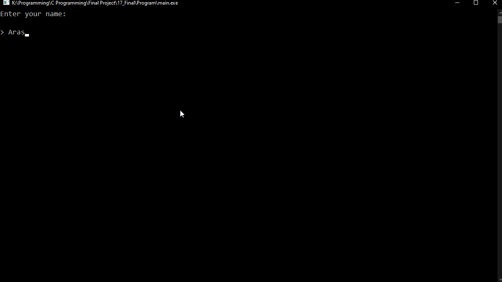

# Hangman-Simple-Game
A terminal-based Hangman game written in C for the final project of my Introduction to Programming course in the first semester at university. Having save/load options and many other cool stuff!

Here’s some gameplay footage:  

